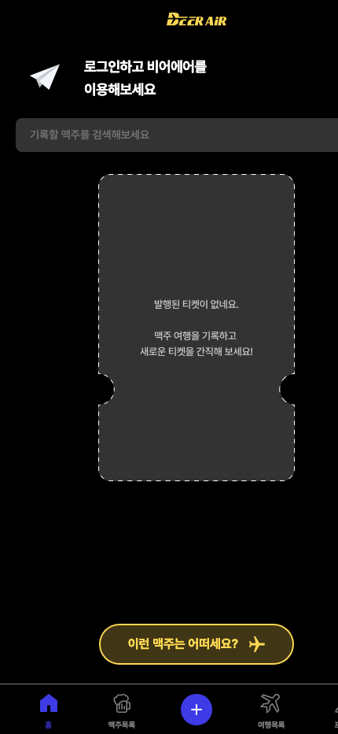

# BeerAir — 세계 맥주로 떠나는 세계 여행

맥주를 기록하며 가상의 여행 경험을 쌓는 BeerAir 웹 클라이언트 복원본입니다. 홈, 맥주 목록·상세, 검색, 맥주 기록, 여행 기록, 프로필 등 기존 제품 플로우와 다크 UI를 그대로 유지하면서 오래된 Next.js 의존성만 현재 실행 환경에 맞게 정리했습니다.

> 과거 팀 프로젝트의 팀원 목록·개인 연락처·더 이상 유효하지 않은 다운로드/운영 링크는 README에서 제거했습니다. 제품 화면과 기존 기능은 보존했습니다.

## Restored preview



위 이미지는 Next.js 16.3.3 production build를 실제 실행해 430×932 viewport에서 캡처한 홈 화면입니다.

## 주요 기능

- 맥주 목록과 상세 정보
- 검색 및 필터
- 마신 맥주 기록
- 개인 맥주 여행 기록
- 추천/좋아요 기반 화면
- 프로필과 기록 관리

## 주요 라우트

```text
/
/beers
/beers/[id]
/search
/record/create/[beerId]
/records/my
/profile
```

## Stack

- Next.js 16.3.3
- React 18
- TypeScript
- Emotion
- React Query
- Recoil
- Storybook

## Run

```bash
yarn install
yarn tsc
yarn build
yarn start
```

현재 복원본에서 TypeScript 검사와 production build를 모두 통과했습니다.
